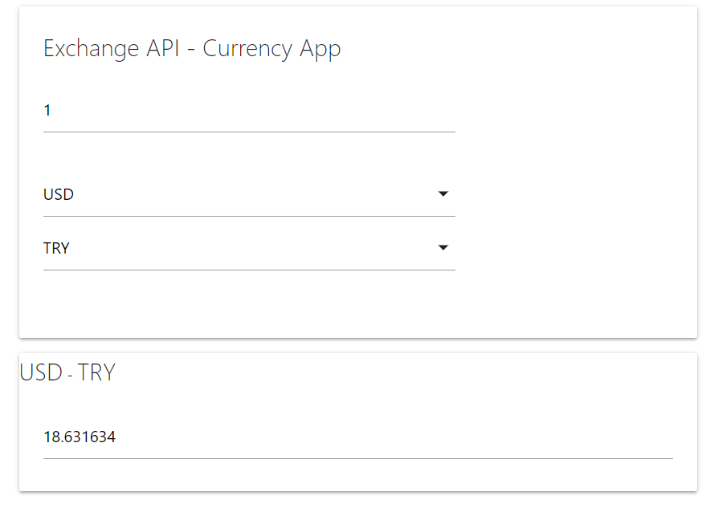

## Currency Conversion Fetch Api



##### Çalışma Notları

- https://api.exchangerate.host/latest apisini kullanacağız ve base ini USD olarak ayarlayacağız.  

- Projenin arayüzünde placeholder ı **miktar** olan input alanına sayısal bir miktar verisi gireceğiz ve bu değer değiştikçe bir **onchange** eventi oluşmasını sağlayacağız. Buraya sadece number tipinde veri girebiliyoruz çünkü type ı da number, id si ise **amount**.  

- 2 tane select list var ve bunlar girilen para birimi cinsi ile hedef parabirimi cinsini temsil ediyorlar. Bu verileri seçip miktar girdikten sonra aşağıdaki, sonuç gösterme işlemini de "#outputResult" id li input içinde yapacağız.  
- Üstteki selectList in id si "#firstCurrncy"  
- Alttaki ise "#secondCurrency"  

1-) elementleri seçerek başlıyoruz.  
- id si amount olan miktar yazılı inputu, 1. selectlist ile 2. select listi seçtik

2-) 2 tane selectList e de "onchange" eventi atamamız gerekiyor çünkü liste içindeni bir para birimi seçildiğinnde bunun aynı bölüme yazılması lazım. Bunun için "eventlistener" fonskiyonumuzu yazıp event atamaları yapıyoruz.

- Miktar her değiştiğinde bir input eventi oluşacak ve exchangeCurrency fonksiyonu çalışacak
`amountElement.addEventListener("input",exchangeCurrency)`

- select listlere de birer onchange eventi atadık ve bu değerler değiştiğinde de yine select index ile seçilen option un textContentini alacağız.

3-) exchangeCurrency fonksiyonunu yazdık `console.log("event oluştu")` şeklinde bir yazdırma işlemi yaptık ve miktar kısmına bir veri girdiğimizde consol çallışıyor.. sıkıntı olmadığını gördük.

4-) currency.js ye geçip bir Currency class ı oluşturduk. Promise yapılarıyla birlikte ES6 kullanarak veri alışverişi yapmaya çalışacağız.

- Currency classının içinde bir tane constructor olacak. Biz app.js den buna vermiş olduğumuz firstCurrency ve secondCurrency değerlerini göndereceğiz.   

- firstCurrency içinde girilen para birimi, secondCurrency içinde çevirmeyi istedğimiz hedef para birimi gönderilecek.

- Constructor içinde ayrıca request atacağımız url yi de ekliyoruzz çünkü birden fazla yerde kullanmamız gerekebilir.

- Ceri alışverişi yapacağımız için bir de amount u oluşturduk ancak amount bilgisi her event oluştuğunda değişeceği için bunu null olarak başlattık. 

- Her event oluştuğuunda amount u first ve last currency leri değiştireceğimz için hepsini de null olarak girebilirdik. Çok fark etmeyecekti.

- Veri alışverişi için kullanacağımız "exchange" methodunu class içinde yazarak başlıyoruz. Burada hem fetch fonksiyonu hem de promise yapısnı kullanacağız. Önce fetch fonnksiyonunun çalıştığından emin olmak için bunu yazdık ve içine this ile url mizi verdik. Daha sonra 2. parametre olarak + ile firsCurrency usd olursa base nin usd olması için this ile firstcurrency i yazdık.

Fetch bize verimizi bir response object şeklinde verecek ve bizde bunun içinden JSON değerini alacağız. Aşağıdaki şekilde requestimiz attık.

```
exchange(){
        fetch(this.url+this.firstCurrency)
        .then(response => response.json())
        .then(data => console.log(data))
        .catch(err => console.log(err))
    }
``` 

5-) app.js ye geçip bir currency objesi oluşturduk ve içine default olarak (USD , TRY) şeklinde değerleri gönderdik. böylece currency objemizi başlatmış olduk. Daha sonra exchangeCurrency fonk içinde exchange methodumuzu çağırdık. Yani input eventi oluştuğunda excahnge fonksiyonu fetch fonksiyonu kullanarak json objesini apiden çekecek. 
- Deneme için consolu açtık miktar kısmına bir sayı girdik ve consolda gelen objemizi gördük.

6-) changeAmount metodunu classa ekleyerek devam ediyoruz. Bu metod içine input eventi oluştuğunda bir amount değeri göndereceğiz ve `this.amount = amount ` dediğimizde sürekli güncellenecek.
- Daha sonra changeFirstCurency metodunu yazdık içine newFirstCurrency parametresini her change eventi oluştuğunda göndereceğiz ve bu metod içinde de onchange eventi oluştuğunda değer güncellenecek. Aynısını second currency için de yaptık
- Bunları selectlistlere atadığımız onchange fonksiyonlarında çalıştırıyoruz ve içlerine selecındex seçilen optionsun textcontentini aldık.
- Daha sonra her event oluştuğunda miktarı güncellemek için app.js deki exchangeCurrency fonksiyonunda  changeAmount fonksiyonunu çalıştırıyoruz. ve içine amount.Elementin calue değerini gönderiyoruz.

7-) 1 try nin kaç usd olduğunu bulmak gibi işlemler için then bloğundan aldığımız data verisini colsolda yazdırmak yerine işlme tabi tutmamız gerekiyor. Bu then bloğunu normal bir fonksiyon haline çevirdik.

- `const parity = data.rates[this.secondCurrency]` json objesinin içindeki rates arryinde para birimi değerleri tutulduğu için `[this.sec..]` dediğimizde istediğimiz birimin değerini almış olacağız. girdiğimiz miktar verisinin tipini number a çevirip amount2 ye atadık ve total ile çevirme işlemini yaptırdık.


8-) Artık consolda çevirme işlemleri çalışıyor.
- Şimdi bir tane promise döndürmemiz gerekiyor ve promisten gelen resolve ve reject değerlerini kullanarak app.js ye veri dönmemiz gerekiyor.
- total ı bulduktan sonra bunu then içinde resolve ile dönüyoruz. Aynı şekilde .catch içinde de hata alırsak reject ile err i dönüyoeruz.
- fetchin üst kısmına gelip `return new Promise((resolve,reject)=>{....` şeklindeki bloğun içine tüm fetc bloğunu aldık

 9-) app.js ye geçiyoruz. exchange() foonksiyonu artık bir promise döndüğü için burdan dönen değerleri then ile yakalayabiliriz.

 10-) aşşağıdaki usd ve try yazılıarını select liste göre ve outputResult id li inputun içindeki placeholder ı da yaptığımız işlemlere göre değiştireceğiz.
                               
```
<span class="card-title" id = "outputFirst">USD</span>
<span>-</span>
<span class="card-title" id = "outputSecond">TRY</span>                         
<div class="card-content">
<input type="text"  name = "outputResult" id = "outputResult" placeholder = "Sonuç" readonly >
```

- Arayüz işlemlerini yapmak için ui.js UI constructor ını yazmaya geçtik. 

- `constructor(firstCurrency,secondeCurrency)` şeklinde selectlist elementlerimizi tekrar aldık.

- id leri ile "outputFirst",  "outputSecond", "outputResult" elementlerini seçtik

- 3 tane metod kullanacağız ve bunlar app.js deki eventler oluştuğunda çalışacak bu sebeple metodları burada kurgulayıp app.js de çağıracağız. ilk 2sinin adı changeFirst ve changeSecond olacak. Bunun için app.js de bir ui objesi oluşturup içine firsrSelect ile secondSlect i gönderdik.
- Daha sonra onchange fonksiyonları içinde içince oluşturmadan önce ui. changeFirst ve changeSecond
şeklinde fonksiyonarımız çağırdık.

11-) Sıra onları ui.js de yazmaya geldi. changeFirst ve changeSecond fonksiyonunda outputFirst ve outputSecond id li spanların textContentini değiştirmek istiyoruz. bunu yine selectedIndex ile yaptık.

12-) Daha sonra displayResult fonskiyonunu kurgulayıp app.js de then bloğu içinde kullanıyoruz.